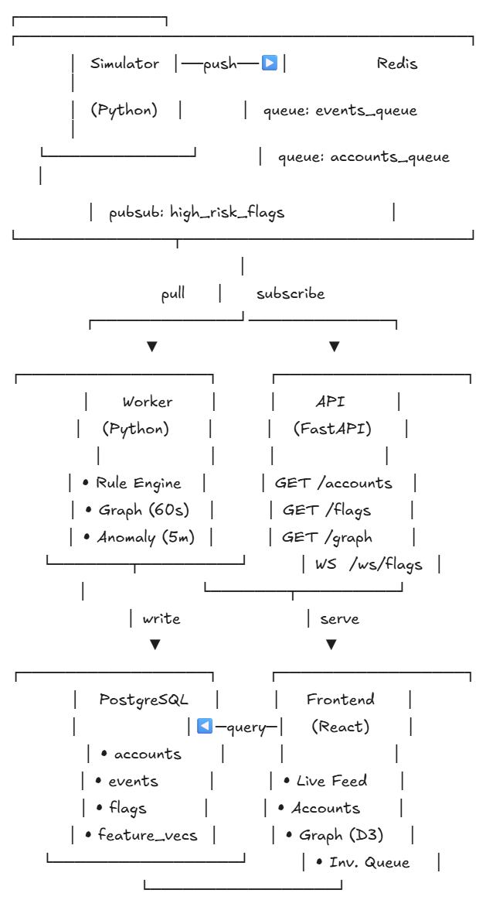

markdown# Sentinel

A real-time social media anomaly detection platform. A Python simulator generates a continuous stream of fake account activity and seeds deliberate anomalies — bot farms, follower spikes, coordinated clusters. A worker pulls from a Redis queue and runs three detection layers in parallel. Findings land in Postgres. A FastAPI backend serves the data and pushes high-risk alerts to a React dashboard over WebSocket.

The whole thing runs with one command.

```bash
docker compose up --build
```

---

## Architecture



---

## How It Works

### The Simulator

Generates a pool of 200 fake accounts and runs in a loop, pushing events into a Redis queue every 300ms. Most events are normal — follows, likes, posts. Every 20 batches it seeds a deliberate anomaly:

- **Bot farm** — 15 accounts all follow the same target simultaneously
- **Follower spike** — one account gains 30 followers in seconds
- **Coordinated cluster** — 8 accounts interact heavily with each other and nobody else

### The Worker

Pulls events off the Redis queue and runs three detection layers:

**Rule engine (every event)**
Simple threshold checks. Gained 500 followers in 10 minutes? Posted 50 times in 5 minutes? Follow/unfollow ratio above 90%? Flag it immediately.

**Graph analyzer (every 60 seconds)**
Builds an account interaction graph using NetworkX. Runs Louvain community detection to find clusters. Flags any cluster where more than 85% of interactions are internal — the signature of coordinated inauthentic behaviour.

**Anomaly detector (every 5 minutes)**
Builds a feature vector per account and runs Isolation Forest across all accounts to find statistical outliers. Cross-checks with Z-scores per feature. Catches slow-burn behaviour that rules and graph analysis miss.

Every flag gets written to Postgres with a score (0–1) and a plain English reason. High-confidence flags (above 0.7) get published to a Redis pub/sub channel so the frontend is notified immediately.

### The API

FastAPI backend with four endpoints and a WebSocket:

| Method | Path | What it does |
|--------|------|-------------|
| GET | `/accounts` | List accounts, filterable by risk score and status |
| GET | `/accounts/{id}/flags` | All flags for a specific account |
| GET | `/flags` | Recent flags across all accounts |
| GET | `/graph` | Current interaction graph as nodes and edges |
| PATCH | `/account/{id}/status` | Move account through investigation workflow |
| WS | `/ws/flags` | Real-time high-risk flag stream |

API docs available at `http://localhost:8000/docs` when running.

### The Dashboard

Four views built in React:

- **Live Feed** — incoming high-risk flags over WebSocket, replays last 20 on reconnect
- **Flagged Accounts** — sortable table with risk score filter, status management
- **Graph View** — D3 force-directed graph, nodes coloured by risk score, drag to explore
- **Investigation Queue** — move accounts through `flagged → reviewing → confirmed / dismissed`

---

## Stack

| Layer | Technology |
|-------|-----------|
| Simulator | Python, Faker, Redis |
| Worker | Python, NetworkX, scikit-learn, scipy, psycopg2 |
| API | FastAPI, SQLAlchemy, asyncpg, redis-py |
| Frontend | React, TypeScript, Vite, D3.js, TanStack Query |
| Database | PostgreSQL 16 |
| Queue / Pub-Sub | Redis 7 |
| Infrastructure | Docker, Docker Compose |

---

## Running Locally

**Prerequisites**
- Docker Desktop (running)
- That's it

**Steps**

```bash
# clone the repo
git clone https://github.com/YOUR_USERNAME/sentinel.git
cd sentinel

# copy the env file
cp .env.example .env

# boot everything
docker compose up --build
```

Then open:
- Dashboard → http://localhost:3000
- API docs → http://localhost:8000/docs

**Useful commands**

```bash
# run in background
docker compose up --build -d

# follow logs from a specific container
docker compose logs -f worker

# stop everything
docker compose down

# fresh start (wipes the database)
docker compose down -v
```

---

## Project Structure
sentinel/

├── docker-compose.yml

├── .env.example

├── architecture.png

├── db/

│   └── init.sql          # table definitions, runs on first postgres boot

├── simulator/

│   ├── main.py           # event generation loop

│   └── generators.py     # account and event factories, anomaly seeders

├── worker/

│   ├── main.py           # queue consumer, orchestrates detection layers

│   ├── rules.py          # threshold-based rule engine

│   ├── graph.py          # networkx graph builder, louvain detection

│   └── anomaly.py        # isolation forest + z-score analysis

├── api/

│   ├── main.py           # fastapi app, cors, router registration

│   ├── routers/          # accounts, flags, graph, websocket

│   ├── models/           # pydantic schemas

│   └── db/               # sqlalchemy orm, async session

└── frontend/

└── src/

├── views/        # livefeed, accountstable, graphview, investigationqueue

├── components/   # flagcard, sidebar

└── hooks/        # useaccounts, useflags, usewebsocket

---

## Detection Logic

The three layers are intentionally layered by cost and cadence:
Rule engine     → cheap, runs on every event, catches obvious violations immediately

Graph analyzer  → moderate cost, runs every 60s, catches coordinated group behaviour

Anomaly detector → higher cost, runs every 5m, catches statistical outliers over time

An account's overall risk score is the rolling average of all its flags. An account caught by multiple layers across multiple runs will naturally accumulate a high score — it's not a one-off spike.

Feature vectors are stored alongside flags so you can track how account behaviour drifts over time, not just whether it was flagged.

---

## What I'd Add With More Time

- Authentication on the API
- Persistent Isolation Forest model between runs (currently retrains every 5 minutes)
- More anomaly types in the simulator
- Account detail view with flag history timeline
- Alerting via email or Slack for confirmed threats
- Unit tests for the detection layers
